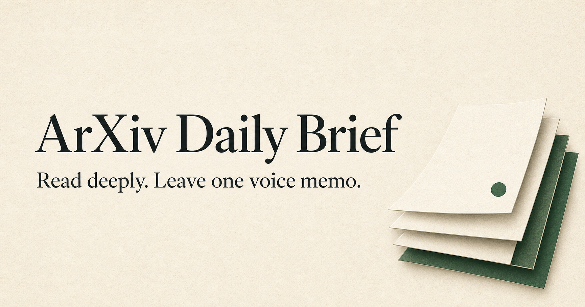
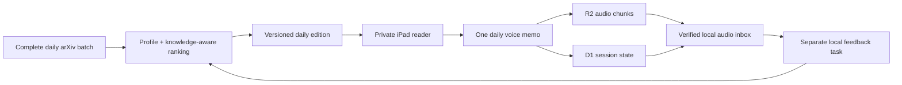

# arXiv Daily Brief

**arXiv, rewritten in your language—with an interactive, supportive reading loop attached.**

This project sweeps the complete daily arXiv announcement batch, filters it through a reader's interests and actual knowledge, and publishes a calm private edition that is comfortable to read on an iPad. It is arXiv-specific: the goal is not generic internet ingestion or avoiding papers. It is to make unfamiliar research discussable now, while building the foundations and questions that help a reader approach the papers themselves.

The repository now includes the working Sites reader product, not just the editorial recipe:

- a sign-in-gated, iPad-first reading app with Home and Archive routes;
- immutable dated versions, so corrections never overwrite reading history;
- one edition-level voice memo that keeps recording across internal navigation;
- 10-second chunk uploads to private R2, with session/status metadata in D1;
- local IndexedDB buffering for network wobble and visible interruption recovery;
- leave-app warnings plus recoverable server-side finalization for abandoned sessions;
- a protected laptop bridge for raw-audio download, hash verification, and acknowledgement;
- no paid transcription dependency—transcription and interpretation happen locally in a separate feedback task.

## What a reading session feels like

Open today's edition, tap **Record**, and read normally. Scroll, open Archive, compare an older edition, and return: one authoritative recorder stays mounted above every internal route, so its state and timer remain visible everywhere. Tap **Finish** once.

The browser presents one logical memo. Internally, each media chunk is stored locally before upload and removed only after R2 confirms it. A network wobble therefore changes the status to “saved locally and reconnecting,” not “lost.” If Safari suspends or closes the document, the server can finalize the already-uploaded chunks as an interrupted but recoverable session.

## Architecture

The reader deliberately stops at the verified raw-audio handoff. A separate daily process owns local/free transcription, feedback interpretation, preference and knowledge updates, and any user-facing Feedback task. This keeps deployment code away from private interpretation state.

## Try your own instance

See [INSTALL.md](INSTALL.md) for the complete setup. The shortest route is:

1. Copy `reader/` into a Sites-capable project.
2. Generate a strong `SITES_INGESTION_SECRET` and store it only in Sites runtime configuration and your ignored laptop configuration.
3. Set owner-only Sites access, build, and deploy.
4. Publish versioned Markdown editions into `reader/generated/editions.ts` using the included catalogue shape.
5. Run the protected downloader from a separate daily feedback process.

The source contains a public sample catalogue only. It contains no owner email, private URL, authentication token, audio, feedback, personal preference state, or private edition text.

## Editorial contract

Each chosen paper should explain:

- what the researchers actually learned;
- what the relevant field should update its beliefs about;
- why it connects to this reader;
- a useful question the reader can ask before reading the paper; and
- what remains unproven.

The complete sweep matters. Keyword alerts find more of what you already know how to name; this process can notice adjacent work and explain why it may matter. The next edition starts with **Follow-up from yesterday**, grounded in actual processed feedback rather than generic continuity filler.

## Repository map

- `reader/` — deployable Sites source for the private iPad reader and voice bridge.
- `scripts/download-voice-inbox.mjs` — protected, hash-verifying laptop downloader.
- `docs/OPERATIONS.md` — storage, recovery, security, and feedback-task boundaries.
- `examples/` — selected public edition excerpts.
- `MY-FEED.md` — one public example of a reader filter.

My private instance contains operational state, raw feedback, and audio; none of those artifacts belong in this public repository.
