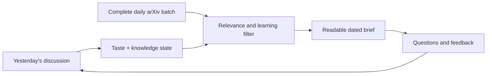

# arXiv Daily Brief

**Read arXiv without having to read arXiv.**

Every morning, an LLM sweeps the complete new arXiv batch, filters it through what I care about and what I already know, then opens a dated chat containing the few ideas worth thinking about.

The output is not a paper leaderboard or a pile of abstract summaries. It assumes I will probably open zero PDFs. Each selected paper has to tell me:

- what the researchers actually learned;
- what the relevant field should update its beliefs about;
- why it connects to something I care about;
- a useful question I can ask without reading the paper; and
- what remains unproven.

The chat becomes the feedback interface. I can say “too much agent research,” “more education and language,” “this connects to my visual testing idea,” or simply keep asking questions. Tomorrow’s brief incorporates that feedback and slowly updates a map of what I have already seen and understood.

## Make your own

You do not need to install my exact stack. Give this repository to an LLM agent that can browse the web, write files, and schedule recurring work, then tell it to adapt the process to your environment:

> Set up this arXiv daily brief for me using the process in this repository. First interview me about my interests and current knowledge. Then create the persistent profile, feedback history, knowledge map, full-batch arXiv ingestion, daily synthesis, and a dated chat/task for each finished edition. Schedule it only after the fresh arXiv batch is available. Assume I may read zero papers, so the daily brief itself must deliver the useful learning. Keep processing out of the discussion chat.

For a more explicit handoff, use [INSTALL.md](INSTALL.md).

## What the loop does

The complete sweep matters. Keyword alerts are good at finding more of what you already know how to name; this process can also notice adjacent work and explain why it might matter.

## What mine looks for

My current mix includes education and learning science, language learning and linguistics, UX/HCI, programming and developer tools, AI systems with transferable product ideas, and exploratory work on embodiment, voice, and singing. The mix is public in [MY-FEED.md](MY-FEED.md), partly so the examples make sense and partly because it is interesting to compare filters.

## Example

[The revised 2026-07-13 brief](examples/2026-07-13.md) is a useful failure-and-correction example. The first pass over-indexed on AI-agent papers. Feedback forced a complete rescan, which surfaced education experiments, cross-linguistic work, UX findings, testing research, and an embodied-sensing study instead.

## Current state

- Complete daily arXiv ingestion: working
- Personal filtering and beginner-friendly synthesis: working
- Feedback and knowledge-state persistence: working
- Dated conversational editions: working
- More sources beyond arXiv: deliberately out of scope for now

This public repository is the portable recipe and a record of selected editions. My private instance contains the operational state and raw feedback history.
