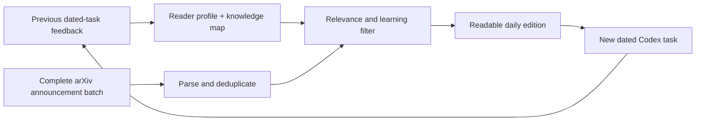

# Internet Ingestion

**A feedback-driven daily research briefing that assumes I will read zero papers.**

Internet Ingestion sweeps the complete daily arXiv announcement batch, filters it through an evolving model of what I care about and what I already understand, then publishes a conversational edition into a fresh Codex task.

The aim is not to produce another intimidating paper list. The briefing should teach enough that I can benefit without opening a PDF—and occasionally make one idea compelling enough that I want to ask questions or go deeper.

## What makes it different

- **Complete ingestion, selective presentation.** The system examines the full announcement batch rather than querying a few fashionable keywords.
- **Feedback changes tomorrow's edition.** Discussion in each dated task updates topic preferences, presentation rules, and an evidence-based knowledge map.
- **Zero-paper default.** Each selection explains the result itself instead of assigning homework.
- **Findings over abstracts.** The useful questions are: what did the researchers learn, what should the field update, why might I care, what can I ask, and what remains unproven?
- **Interests are wider than AI.** Current tracks include UX/HCI, education and children's AI education, language learning and linguistics, programming and developer tools, plus exploratory somatic, voice, and singing research.

## Pipeline

## Example

See [selected excerpts from the revised 2026-07-13 edition](examples/2026-07-13.md), produced after the first edition over-indexed on AI-agent papers and the feedback loop forced a broader rescan.

## Current status

- Full-batch arXiv ingestion: working
- Conversational daily editions: working
- Feedback and knowledge-state persistence: working
- Remote scheduled publishing: being moved from a local Mac to Codex remote
- Additional internet sources: planned

The operational repository is private because it contains raw feedback history and automation state. This public repository documents the design and publishes selected examples.
